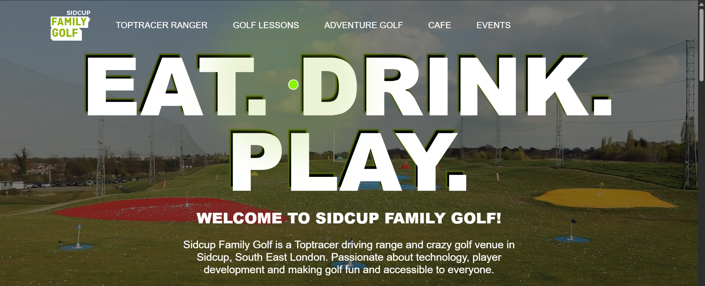

# 🏌️‍♂️ Sidcup Family Golf – Front-End Website

A modern and responsive **front-end website** for **Sidcup Family Golf**, a vibrant golf and leisure venue.  
This project recreates the real-world website’s interactive design, smooth animations, and professional UI using HTML, CSS, and JavaScript.

---

## 🌐 Live Demo
👉 **[View Live Website](https://harshit-80989.github.io/SidCup-Family-Golf-Front-End/)**

---

## 📸 Preview

---

## 💡 Features

- 🎨 Fully responsive and elegant front-end design  
- 🧭 Animated navigation bar with hover effects  
- 🏌️ Hero section with background video  
- ✨ Big bold “EAT. DRINK. PLAY.” animated text  
- ⚡ Smooth scroll animations using GSAP  
- 💬 Informative content sections: Toptracer Ranger, Golf Lessons, Café, Events  
- 📱 Works seamlessly across devices  

---

## 🧰 Tech Stack

| Technology | Purpose |
|-------------|----------|
| **HTML5** | Structure and content |
| **CSS3** | Styling and responsive design |
| **JavaScript (ES6)** | Interactivity and animations |
| **GSAP** | Scroll-triggered animations |
| **GitHub Pages** | Hosting the live demo |

---
